# PSYCHOHISTORY · Stage 3 索引

> **Zettelkasten 风格技能总索引**  
> 系列：`Game Theory` | 技能总数：**52**  
> 生成日期：2026-07-13

---

## 目录

1. [技能总览表（按组分类）](#1-技能总览表按组分类)
2. [Mermaid 依赖关系图](#2-mermaid-依赖关系图)
3. [依赖关系表](#3-依赖关系表)
4. [按触发场景索引](#4-按触发场景索引)
5. [术语表（聚合）](#5-术语表聚合)

---

## 1. 技能总览表（按组分类）

### 🎲 Game Theory Frameworks（5）

| # | 文件名 | 名称 | 一句话描述 |
|---|--------|------|-----------|
| 1 | [[gt-game-theory-elite-overproduction]] | 精英过剩与革命周期 | 权力层级为零和博弈——精英过度繁殖导致权力位置枯竭、社会流动性冻结，最终触发革命级游戏重置 |
| 2 | [[gt-game-theory-immigration-trap]] | 移民陷阱——被操纵博弈中的逆向策略 | 当被邀请进入他人设计的游戏时，遵守规则必然失败——唯一获胜策略是拒绝按规则玩、通过族群凝聚力和高生育率实现人口逆转 |
| 3 | [[gt-game-theory-escalation]] | 升级法则——校准优于压制的战略博弈 | 战略博弈中控制（calibration）优于压制（dominance）——通过校准反应、保持战略灵活性，操纵强者走向自我毁灭 |
| 4 | [[gt-game-theory-proximity]] | 邻近法则——多博弈嵌套中的决策优先级 | 任何人/国家在任何时刻都参与多个嵌套博弈，而最影响决策的永远是那个"最靠近"的博弈——内部冲突压过外部冲突 |
| 5 | [[gt-game-theory-asymmetry]] | 非对称法则——弱者反制帝国的三维框架 | 帝国的三大优势（人口、组织、承受力）在长期转化为致命劣势，而弱者的能量-开放-凝聚力三维优势是反制核心 |

### 🌍 Geopolitics（3）

| # | 文件名 | 名称 | 一句话描述 |
|---|--------|------|-----------|
| 6 | [[gt-geopolitics-currency-war]] | 货币战争——美元霸权与帝国命门 | 美元作为全球储备货币是美国帝国的核心命门——摧毁美元霸权是推翻美国世界秩序的唯一路径 |
| 7 | [[gt-geopolitics-three-laws]] | 地缘政治三定律——强权博弈的底层规则 | 强者互相尊重并共同掠夺弱者；弱者无法有效合作必须依附强者；强者之间休战源于承认彼此的势力范围 |
| 8 | [[gt-geopolitics-chokepoint]] | 全球咽喉要道控制 | 美国通过控制全球海上咽喉要道制造地区混乱，迫使各国依赖美国的能源、武器和融资 |

### 🏛️ Civilization Patterns（8）

| # | 文件名 | 名称 | 一句话描述 |
|---|--------|------|-----------|
| 9 | [[gt-civilization-eoc-model]] | 三维社会动力模型（EOC） | 能量（E）、开放性（O）、凝聚力（C）三个维度共同决定社会在文明竞争中的成败 |
| 10 | [[gt-civilization-asabiyyah]] | 阿萨比亚定律：边缘征服中心 | 边缘群体因生存压力保持高凝聚力，最终征服富裕但腐化的中心文明 |
| 11 | [[gt-civilization-institutional-sclerosis]] | 制度硬化——帝国刚性化衰退 | 文明从创新开放的战国阶段走向均衡帝国后，贤能政治退化为刚性等级，宗教退化为官僚化规则体系 |
| 12 | [[gt-civilization-fertility-leading-indicator]] | 生育率先行指标律 | 富裕、受过教育的女性拒绝生育是文明衰亡最准确的先行指标，反映地位游戏取代繁衍本能 |
| 13 | [[gt-civilization-military-industrial-complex]] | 军事-工业复合体——内部吞噬者 | 晚期帝国的军事机构从外部防御工具蜕变为内部寄生虫，制造永无止境的战争以向跨国精英输送财富 |
| 14 | [[gt-civilization-elite-overproduction]] | 精英过度生产与派系斗争律 | 精英阶层数量激增导致社会分裂为相互争斗的派系，各派系为内斗胜利不惜牺牲文明整体利益 |
| 15 | [[gt-civilization-mercenary-overthrow]] | 雇佣兵反噬——帝国替代模式 | 帝国招募边缘群体作为雇佣兵执行暴力，但雇佣兵在过程中变得更有凝聚力，最终替代腐败的帝国 |
| 16 | [[gt-civilization-three-superstructures]] | 文明三大超结构阶段论 | 文明演化经历低人口乱交、增长人口包办婚姻、过剩人口约会游戏三阶段，每阶段决定不同的婚姻、性别和生育策略 |

### 🙏 Religion & Narrative（8）

| # | 文件名 | 名称 | 一句话描述 |
|---|--------|------|-----------|
| 17 | [[gt-religion-money-as-god]] | 货币作为上帝——资本的世俗神学 | 货币在功能上具备神的一切属性——全在、全知、信仰对象——银行炼金术将无价值的纸变成黄金 |
| 18 | [[gt-religion-pax-judaica]] | Pax Judaica 神学帝国 | 将圣经预言（从尼罗河到幼发拉底的大以色列）、卡巴拉神秘主义与AI监控国家合并为一个神学-技术帝国方案 |
| 19 | [[gt-religion-eschatological-convergence]] | 七大末世论汇聚 | 七个主要宗教传统的末世叙事尽管表面不同，却预测相同的核心地缘政治事件——大战、第三圣殿、统一世界政府 |
| 20 | [[gt-religion-communism-as-anti-religion]] | 共产主义作为反宗教武器 | 共产主义不是资本主义的敌人，而是资本主义精英创造出来用于摧毁宗教、君主制、民族主义和民主的工具 |
| 21 | [[gt-religion-kabbalistic-redemption]] | 卡巴拉通过罪恶救赎 | 破碎是迎接神圣智慧的必要前提，毁灭是修复世界（Tikkun Olam）的先决条件 |
| 22 | [[gt-religion-messianic-accelerationism]] | 弥赛亚加速主义 | 宗教极端派系认为可以通过人为制造末世条件来强迫神干预历史、加速弥赛亚到来 |
| 23 | [[gt-religion-ai-stargate-rapture]] | AI作为宗教项目——星门、恶魔与灾难 | OpenAI等项目本质上不是科学事业，而是以创造神和触发末世灾难为核心使命的宗教/神秘学项目 |
| 24 | [[gt-religion-eschatology-geopolitics]] | 末世论作为地缘政治编码 | 末世论不是超自然宗教，而是将数千年地缘政治模式压缩为寓言故事的知识传递技术 |

### 🔮 Predictive Models ⭐（12）

| # | 文件名 | 名称 | 一句话描述 |
|---|--------|------|-----------|
| 25 | [[gt-predictive-002]] | 博弈胜率量化评估法 M×E×C | 用质量×能量×协调公式量化评估多方博弈场景中的综合胜率 |
| 26 | [[gt-predictive-003]] | 多重框架汇聚验证法 | 同时用多个独立理论框架分析同一事件，若结论一致则预测可信度大幅提升 |
| 27 | [[gt-predictive-006]] | 国际象棋大战略预测模型 | 将每个国家解构为国际象棋棋局——王=政治系统、后=大战略、象/马/车=攻击手段、兵=消耗品 |
| 28 | [[gt-predictive-005]] | 帝国衰退三指标诊断法 | 通过金融化、人口危机、精英过度生产三项指标诊断帝国/大组织的衰退阶段 |
| 29 | [[gt-predictive-001]] | 末法汇聚预测法 | 通过分析各文明最极端的末世论版本，找到叙事汇聚点来预测国际冲突演化方向 |
| 30 | [[gt-predictive-010]] | 历史类比预测法 | 通过寻找驱动结构（而非表面事件）的相似历史先例来预测当前重大事件的演化方向 |
| 31 | [[gt-predictive-011]] | AI 祭仪技术预测框架 | 从驱动AI公司的意识形态/神秘主义信仰出发预测AI行业的发展方向 |
| 32 | [[gt-predictive-009]] | 喀巴拉加速主义预测法 | 从喀巴拉"通过作恶加速救赎"的神学逻辑出发预测以色列等行为体的极端行为 |
| 33 | [[gt-predictive-012]] | 马赛克防御与死机开关分析 | 通过分析对手的组织结构（去中心化 vs 集中化）来预测冲突的可谈判性和演化路径 |
| 34 | [[gt-predictive-008]] | 美元瘾症与崩溃预测 | 从"维护美元霸权/强制美债购买"角度预测美国外交政策和军事干预行为 |
| 35 | [[gt-predictive-015]] | 全球咽喉点控制预测 | 通过绘制全球关键咽喉点的控制权分布来预测大国博弈格局和贸易/能源流向 |
| 36 | [[gt-predictive-013]] | 内战投射理论 | 将"内战外推"作为关键预测机制——国内越乱，短期内对外冒险的概率越高 |

### ⚠️ Failure Mode Warnings（7）

| # | 文件名 | 名称 | 一句话描述 |
|---|--------|------|-----------|
| 37 | [[gt-failure-ai-consciousness]] | AI 意识幻觉 | 人类倾向于将意识投射到无生命物体上，误以为AI具有智能和意识——这种认知偏见源于"希望它是真的"的欲望 |
| 38 | [[gt-failure-advantage-paradox]] | 帝国优势即劣势悖论 | 帝国的三大核心优势在长期恰恰是自我毁灭的种子：规模→不平等，组织→精英过剩，资源→傲慢 |
| 39 | [[gt-failure-false-dichotomy]] | 虚假二元对立 | 资本主义与共产主义并非截然对立——两者在反君主制、宗教、民族主义和民主上完全一致，虚假对立掩盖了更深层的权力结构 |
| 40 | [[gt-failure-dunning-kruger]] | 达克效应识别 | 无能者无法认识到自己的无能——掌权者往往愚蠢却极度自信，因缺乏自我评估能力而导致灾难性决策 |
| 41 | [[gt-failure-nation-state]] | 民族国家幻觉 | 将民族国家视为国际政治的独立行为体是一个根本性的分析错误——国家只是精英利益的集合体 |
| 42 | [[gt-failure-great-man]] | 伟人迷思 | 认为一人可控一国是根本性迷思——国家的行为由不同既得利益集团和机构共同决定 |
| 43 | [[gt-failure-correlation-causation]] | 相关即因果谬误 | 将相关性误认为因果关系的认知错误——成功人士确实早起但早起并非成功原因 |

### 📖 Glossary（9）

| # | 文件名 | 名称 | 一句话描述 |
|---|--------|------|-----------|
| 44 | [[gt-glossary-game-theory-definition]] | 博弈论三组件定义 | 任何博弈由三个组件组成——玩家（Players）、规则/约束条件（Rules/Boundary Conditions）和激励/收益（Incentives） |
| 45 | [[gt-glossary-cohesion-openness-energy]] | 凝聚力-开放度-能量（EOC） | 评估社会/组织生命力的三维度：能量（勤奋与动机）、开放度（学习与适应性）、凝聚力（团结与牺牲精神） |
| 46 | [[gt-glossary-reality-hallucination]] | 现实即幻觉——洞穴寓言框架 | 现实是集体幻觉——真正"真实"的是人类的意识和注意力，权力就是操控他人注意力的能力 |
| 47 | [[gt-glossary-technate]] | 技术统治国（Technate） | 美国帝国的终极愿景——将整个北美统一为一个AI监控的技术专家统治堡垒，民主被技术官僚和AI治理取代 |
| 48 | [[gt-glossary-mosaic-defense]] | 马赛克防御 | 伊朗的去中心化军事组织模式——31个省份各自为独立作战单元，无中央指挥，使外部斩首和停火谈判几乎不可能 |
| 49 | [[gt-glossary-superstructure]] | 超级结构（宏观结构） | 决定游戏性质的大背景——人口结构、经济水平、文化、政治、宗教共同构成超级结构，决定玩家玩的是什么游戏 |
| 50 | [[gt-glossary-asymmetry]] | 非对称法则（Glossary 定义） | 作者原创的核心理论——帝国的巨大优势在长期博弈中系统地转化为致命劣势，弱者反而拥有结构性相对优势 |
| 51 | [[gt-glossary-elite-overproduction]] | 精英过剩（Glossary 定义） | Peter Turchin 提出的概念——精英阶层人口过多而权力位置有限，导致过剩精英联合底层发动革命或战争 |
| 52 | [[gt-glossary-nash-equilibrium]] | 纳什均衡（批判性定义） | 纳什均衡描述所有玩家最大化自身收益的稳定状态，但现实中人们的行为是"自杀性的"、根本不按纳什均衡行事 |

---

## 2. Mermaid 依赖关系图

```mermaid
graph TD

    subgraph "🎲 Game Theory Frameworks"
        GT_ELITE["gt-game-theory-elite-overproduction<br/>精英过剩与革命周期"]
        GT_IMMIG["gt-game-theory-immigration-trap<br/>移民陷阱"]
        GT_ESCAL["gt-game-theory-escalation<br/>升级法则"]
        GT_PROX["gt-game-theory-proximity<br/>邻近法则"]
        GT_ASYMM["gt-game-theory-asymmetry<br/>非对称法则"]
    end

    subgraph "🌍 Geopolitics"
        GEO_CURR["gt-geopolitics-currency-war<br/>货币战争"]
        GEO_3LAWS["gt-geopolitics-three-laws<br/>地缘政治三定律"]
        GEO_CHOKE["gt-geopolitics-chokepoint<br/>咽喉要道控制"]
    end

    subgraph "🏛️ Civilization Patterns"
        CIV_EOC["gt-civilization-eoc-model<br/>EOC三维动力模型"]
        CIV_ASAB["gt-civilization-asabiyyah<br/>阿萨比亚定律"]
        CIV_SCLER["gt-civilization-institutional-sclerosis<br/>制度硬化"]
        CIV_FERT["gt-civilization-fertility-leading-indicator<br/>生育率先行指标"]
        CIV_MIC["gt-civilization-military-industrial-complex<br/>军事-工业复合体"]
        CIV_ELITE["gt-civilization-elite-overproduction<br/>精英过度生产"]
        CIV_MERC["gt-civilization-mercenary-overthrow<br/>雇佣兵反噬"]
        CIV_SUPER["gt-civilization-three-superstructures<br/>三大超结构"]
    end

    subgraph "🙏 Religion & Narrative"
        REL_MONEY["gt-religion-money-as-god<br/>货币作为上帝"]
        REL_PAX["gt-religion-pax-judaica<br/>Pax Judaica"]
        REL_ESCHCON["gt-religion-eschatological-convergence<br/>七大末世论汇聚"]
        REL_COMMIE["gt-religion-communism-as-anti-religion<br/>共产主义反宗教武器"]
        REL_KABBAL["gt-religion-kabbalistic-redemption<br/>卡巴拉救赎"]
        REL_MESS["gt-religion-messianic-accelerationism<br/>弥赛亚加速主义"]
        REL_AI["gt-religion-ai-stargate-rapture<br/>AI星门项目"]
        REL_ESCHGEO["gt-religion-eschatology-geopolitics<br/>末世论地缘编码"]
    end

    subgraph "🔮 Predictive Models ⭐"
        PRE_MEC["gt-predictive-002<br/>M×E×C胜率评估"]
        PRE_TRIPLE["gt-predictive-003<br/>多重框架汇聚验证"]
        PRE_CHESS["gt-predictive-006<br/>国际象棋大战略"]
        PRE_DECLINE["gt-predictive-005<br/>帝国衰退三指标"]
        PRE_ESCH["gt-predictive-001<br/>末法汇聚预测"]
        PRE_HIST["gt-predictive-010<br/>历史类比预测"]
        PRE_AICULT["gt-predictive-011<br/>AI祭仪预测"]
        PRE_KABBAL["gt-predictive-009<br/>喀巴拉加速主义"]
        PRE_MOSAIC["gt-predictive-012<br/>马赛克防御"]
        PRE_DOLLAR["gt-predictive-008<br/>美元瘾症"]
        PRE_CHOKE["gt-predictive-015<br/>咽喉点控制"]
        PRE_CIVWAR["gt-predictive-013<br/>内战投射理论"]
    end

    subgraph "⚠️ Failure Mode"
        FAI_AICON["gt-failure-ai-consciousness<br/>AI意识幻觉"]
        FAI_PARADOX["gt-failure-advantage-paradox<br/>优势即劣势"]
        FAI_DICHOT["gt-failure-false-dichotomy<br/>虚假二元对立"]
        FAI_DK["gt-failure-dunning-kruger<br/>达克效应"]
        FAI_NATION["gt-failure-nation-state<br/>民族国家幻觉"]
        FAI_GREAT["gt-failure-great-man<br/>伟人迷思"]
        FAI_CORR["gt-failure-correlation-causation<br/>相关即因果"]
    end

    subgraph "📖 Glossary"
        GLOSS_GT["gt-glossary-game-theory-definition<br/>博弈论三组件"]
        GLOSS_EOC["gt-glossary-cohesion-openness-energy<br/>EOC三维定义"]
        GLOSS_REAL["gt-glossary-reality-hallucination<br/>洞穴寓言"]
        GLOSS_TECH["gt-glossary-technate<br/>Technate"]
        GLOSS_MOSAIC["gt-glossary-mosaic-defense<br/>马赛克防御"]
        GLOSS_SUPER["gt-glossary-superstructure<br/>超级结构"]
        GLOSS_ASYMM["gt-glossary-asymmetry<br/>非对称法则定义"]
        GLOSS_ELITE["gt-glossary-elite-overproduction<br/>精英过剩定义"]
        GLOSS_NASH["gt-glossary-nash-equilibrium<br/>纳什均衡批判"]
    end

    %% ── Civilization Patterns ──
    CIV_EOC -->|depends-on| CIV_ASAB
    CIV_FERT -->|depends-on| CIV_SUPER
    CIV_MIC -->|depends-on| CIV_SCLER
    CIV_MIC -->|depends-on| CIV_ELITE
    CIV_MERC -->|depends-on| CIV_ASAB

    CIV_EOC -.->|composes-with| CIV_ELITE
    CIV_EOC -.->|composes-with| CIV_SCLER
    CIV_ASAB -.->|composes-with| CIV_EOC
    CIV_ASAB -.->|composes-with| CIV_MERC
    CIV_SCLER -.->|composes-with| CIV_ELITE
    CIV_SCLER -.->|composes-with| CIV_EOC
    CIV_FERT -.->|composes-with| CIV_EOC
    CIV_FERT -.->|composes-with| CIV_ELITE
    CIV_MIC -.->|composes-with| CIV_MERC
    CIV_ELITE -.->|composes-with| CIV_SCLER
    CIV_ELITE -.->|composes-with| CIV_EOC
    CIV_MERC -.->|composes-with| CIV_MIC
    CIV_SUPER -.->|composes-with| CIV_FERT
    CIV_SUPER -.->|composes-with| CIV_EOC

    CIV_ASAB -.-x|contrasts| CIV_SCLER
    CIV_ASAB -.-x|contrasts| CIV_ELITE
    CIV_SCLER -.-x|contrasts| CIV_ASAB
    CIV_ELITE -.-x|contrasts| CIV_ASAB

    %% ── Religion & Narrative ──
    REL_MONEY -->|depends-on| REL_ESCHGEO
    REL_PAX -->|depends-on| REL_MESS
    REL_PAX -->|depends-on| REL_KABBAL
    REL_ESCHCON -->|depends-on| REL_ESCHGEO
    REL_MESS -->|depends-on| REL_ESCHGEO
    REL_AI -->|depends-on| REL_ESCHGEO

    REL_MONEY -.->|composes-with| REL_AI
    REL_MONEY -.->|composes-with| REL_PAX
    REL_PAX -.->|composes-with| REL_ESCHCON
    REL_PAX -.->|composes-with| REL_AI
    REL_ESCHCON -.->|composes-with| REL_MESS
    REL_ESCHCON -.->|composes-with| REL_PAX
    REL_COMMIE -.->|composes-with| REL_ESCHCON
    REL_KABBAL -.->|composes-with| REL_MESS
    REL_KABBAL -.->|composes-with| REL_PAX
    REL_MESS -.->|composes-with| REL_KABBAL
    REL_MESS -.->|composes-with| REL_ESCHCON
    REL_MESS -.->|composes-with| REL_PAX
    REL_AI -.->|composes-with| REL_MONEY
    REL_AI -.->|composes-with| REL_ESCHCON
    REL_ESCHGEO -.->|composes-with| REL_ESCHCON
    REL_ESCHGEO -.->|composes-with| REL_MESS

    REL_MONEY -.-x|contrasts| REL_COMMIE

    %% ── Predictive Models ⭐ ──
    PRE_TRIPLE -->|CENTRAL HUB| PRE_ESCH
    PRE_TRIPLE -->|CENTRAL HUB| PRE_DECLINE
    PRE_TRIPLE -.->|composes-with| PRE_CIVWAR

    PRE_MEC -.->|composes-with| PRE_ESCH
    PRE_MEC -.->|composes-with| PRE_KABBAL
    PRE_CHESS -.->|composes-with| PRE_HIST
    PRE_DECLINE -.->|composes-with| PRE_CIVWAR
    PRE_ESCH -.->|composes-with| PRE_MEC
    PRE_HIST -.->|composes-with| PRE_CIVWAR
    PRE_HIST -.->|composes-with| PRE_CHESS
    PRE_AICULT -.->|composes-with| PRE_CIVWAR
    PRE_AICULT -.->|composes-with| PRE_MEC
    PRE_KABBAL -.->|composes-with| PRE_CHESS
    PRE_KABBAL -.->|composes-with| PRE_CHOKE
    PRE_MOSAIC -.->|composes-with| PRE_MEC
    PRE_DOLLAR -.->|composes-with| PRE_HIST
    PRE_CHOKE -.->|composes-with| PRE_HIST
    PRE_CIVWAR -.->|composes-with| PRE_CHESS
    PRE_CIVWAR -.->|composes-with| PRE_KABBAL

    PRE_ESCH -.-x|contrasts| PRE_HIST
    PRE_HIST -.-x|contrasts| PRE_ESCH
    PRE_MOSAIC -.-x|contrasts| PRE_CHESS
    PRE_DOLLAR -.-x|contrasts| PRE_ESCH

    %% ── Cross-group links ──
    GT_ASYMM -.->|composes-with| CIV_EOC
    GT_ASYMM -.->|composes-with| CIV_ELITE
    GT_ASYMM -.->|composes-with| CIV_ASAB
    PRE_ESCH -->|depends-on| REL_ESCHGEO
```

---

## 3. 依赖关系表

### depends-on（前置依赖）

| 来源 | 依赖 | 类型 | 说明 |
|------|------|------|------|
| [[gt-civilization-eoc-model]] | [[gt-civilization-asabiyyah]] | 前置依赖 | EOC模型借鉴了伊本·赫勒敦的阿萨比亚概念 |
| [[gt-civilization-fertility-leading-indicator]] | [[gt-civilization-three-superstructures]] | 前置依赖 | 生育率先行指标需要用超结构阶段来定位 |
| [[gt-civilization-military-industrial-complex]] | [[gt-civilization-institutional-sclerosis]] | 前置依赖 | MIC是制度硬化的特定表现 |
| [[gt-civilization-military-industrial-complex]] | [[gt-civilization-elite-overproduction]] | 前置依赖 | MIC与精英过剩共同构成帝国晚期特征 |
| [[gt-civilization-mercenary-overthrow]] | [[gt-civilization-asabiyyah]] | 前置依赖 | 雇佣兵反噬是阿萨比亚定律的具体实现 |
| [[gt-religion-money-as-god]] | [[gt-religion-eschatology-geopolitics]] | 前置依赖 | 货币神学需理解末世论的地缘编码本质 |
| [[gt-religion-pax-judaica]] | [[gt-religion-messianic-accelerationism]] | 前置依赖 | Pax Judaica 需要弥赛亚加速主义作为驱动力 |
| [[gt-religion-pax-judaica]] | [[gt-religion-kabbalistic-redemption]] | 前置依赖 | Pax Judaica 需要卡巴拉救赎逻辑作为神学基础 |
| [[gt-religion-eschatological-convergence]] | [[gt-religion-eschatology-geopolitics]] | 前置依赖 | 末世论汇聚框架建立在地缘编码学说之上 |
| [[gt-religion-messianic-accelerationism]] | [[gt-religion-eschatology-geopolitics]] | 前置依赖 | 加速主义需要先理解末世论的本质 |
| [[gt-religion-ai-stargate-rapture]] | [[gt-religion-eschatology-geopolitics]] | 前置依赖 | AI宗教项目本质是末世论的技术版本 |
| [[gt-predictive-001]] | [[gt-religion-eschatology-geopolitics]] | 前置依赖 | 末法汇聚预测法需要先理解末世论作为编码 |

### contrasts-with（对比/对立）

| 来源 | 对比对象 | 说明 |
|------|----------|------|
| [[gt-civilization-asabiyyah]] | [[gt-civilization-institutional-sclerosis]] | 边缘凝聚力 vs 中心僵化 |
| [[gt-civilization-asabiyyah]] | [[gt-civilization-elite-overproduction]] | 边缘团结 vs 精英分斗 |
| [[gt-civilization-institutional-sclerosis]] | [[gt-civilization-asabiyyah]] | 刚性等级 vs 边缘活力 |
| [[gt-civilization-elite-overproduction]] | [[gt-civilization-asabiyyah]] | 精英分裂 vs 边缘团结 |
| [[gt-civilization-military-industrial-complex]] | [[gt-civilization-asabiyyah]] | 寄生虫式军事 vs 边缘凝聚力 |
| [[gt-religion-money-as-god]] | [[gt-religion-communism-as-anti-religion]] | 金钱之神 vs 反宗教叙事 |
| [[gt-predictive-001]] | [[gt-predictive-010]] | 末世论预测 vs 历史类比预测 |
| [[gt-predictive-010]] | [[gt-predictive-001]] | 历史类比 vs 末世论预测 |
| [[gt-predictive-012]] | [[gt-predictive-006]] | 去中心化分析 vs 国际象棋集中模型 |
| [[gt-predictive-008]] | [[gt-predictive-001]] | 经济驱动 vs 叙事驱动 |

### composes-with（组合/协同）

| 来源 | 组合对象 | 说明 |
|------|----------|------|
| [[gt-civilization-eoc-model]] | [[gt-civilization-elite-overproduction]] | EOC + 精英过剩分析衰退 |
| [[gt-civilization-eoc-model]] | [[gt-civilization-institutional-sclerosis]] | EOC + 制度硬化诊断帝国 |
| [[gt-civilization-asabiyyah]] | [[gt-civilization-eoc-model]] | 阿萨比亚是EOC的凝聚力维度 |
| [[gt-civilization-asabiyyah]] | [[gt-civilization-mercenary-overthrow]] | 边缘→雇佣兵→替代路径 |
| [[gt-civilization-institutional-sclerosis]] | [[gt-civilization-elite-overproduction]] | 硬化+过剩→全面僵化 |
| [[gt-civilization-institutional-sclerosis]] | [[gt-civilization-eoc-model]] | 硬化导致EOC全面下降 |
| [[gt-civilization-fertility-leading-indicator]] | [[gt-civilization-eoc-model]] | 生育率是EOC的量化指标 |
| [[gt-civilization-fertility-leading-indicator]] | [[gt-civilization-elite-overproduction]] | 低生育+精英过剩=崩溃加速 |
| [[gt-civilization-military-industrial-complex]] | [[gt-civilization-mercenary-overthrow]] | MIC+雇佣兵=双重新陈代谢路径 |
| [[gt-civilization-elite-overproduction]] | [[gt-civilization-institutional-sclerosis]] | 精英过剩驱动制度硬化 |
| [[gt-civilization-elite-overproduction]] | [[gt-civilization-eoc-model]] | 精英过剩降低EOC |
| [[gt-civilization-mercenary-overthrow]] | [[gt-civilization-military-industrial-complex]] | 雇佣兵替代 vs MIC吞噬 |
| [[gt-civilization-three-superstructures]] | [[gt-civilization-fertility-leading-indicator]] | 超结构阶段→生育率预测 |
| [[gt-civilization-three-superstructures]] | [[gt-civilization-eoc-model]] | 超结构决定EOC基线 |
| [[gt-religion-money-as-god]] | [[gt-religion-ai-stargate-rapture]] | 金钱之神→AI之神更替 |
| [[gt-religion-money-as-god]] | [[gt-religion-pax-judaica]] | 货币神学+神学帝国 |
| [[gt-religion-pax-judaica]] | [[gt-religion-eschatological-convergence]] | 神学帝国是末世汇聚的结果 |
| [[gt-religion-pax-judaica]] | [[gt-religion-ai-stargate-rapture]] | 神学帝国+AI监控=技术神权 |
| [[gt-religion-eschatological-convergence]] | [[gt-religion-messianic-accelerationism]] | 汇聚点→加速主义行动 |
| [[gt-religion-eschatological-convergence]] | [[gt-religion-pax-judaica]] | 汇聚点指向Pax Judaica |
| [[gt-religion-kabbalistic-redemption]] | [[gt-religion-messianic-accelerationism]] | 救赎神学→加速主义 |
| [[gt-religion-kabbalistic-redemption]] | [[gt-religion-pax-judaica]] | 卡巴拉逻辑→帝国方案 |
| [[gt-religion-messianic-accelerationism]] | [[gt-religion-kabbalistic-redemption]] | 加速主义需要救赎神学 |
| [[gt-religion-messianic-accelerationism]] | [[gt-religion-eschatological-convergence]] | 加速主义利用汇聚点 |
| [[gt-religion-messianic-accelerationism]] | [[gt-religion-pax-judaica]] | 加速主义驱动Pax Judaica |
| [[gt-religion-ai-stargate-rapture]] | [[gt-religion-eschatological-convergence]] | AI末世论加入汇聚 |
| [[gt-religion-ai-stargate-rapture]] | [[gt-religion-money-as-god]] | AI作为新神替代金钱之神 |
| [[gt-religion-eschatology-geopolitics]] | [[gt-religion-eschatological-convergence]] | 编码方法→汇聚分析 |
| [[gt-religion-eschatology-geopolitics]] | [[gt-religion-messianic-accelerationism]] | 理解编码→加速主义 |
| [[gt-predictive-002]] | [[gt-predictive-001]] | MEC公式+末法预测 |
| [[gt-predictive-002]] | [[gt-predictive-009]] | MEC公式+喀巴拉分析 |
| [[gt-predictive-003]] | [[gt-predictive-010]] | 多重框架+历史类比 |
| [[gt-predictive-006]] | [[gt-predictive-010]] | 棋局模型+历史类比 |
| [[gt-predictive-005]] | [[gt-predictive-013]] | 衰退诊断+内战投射 |
| [[gt-predictive-001]] | [[gt-predictive-002]] | 末法预测需要MEC量化 |
| [[gt-predictive-010]] | [[gt-predictive-013]] | 历史类比+内战投射 |
| [[gt-predictive-010]] | [[gt-predictive-006]] | 历史类比+棋局模型 |
| [[gt-predictive-011]] | [[gt-predictive-013]] | AI祭仪+内战投射 |
| [[gt-predictive-011]] | [[gt-predictive-002]] | AI祭仪+MEC量化 |
| [[gt-predictive-009]] | [[gt-predictive-006]] | 喀巴拉+棋局模型 |
| [[gt-predictive-009]] | [[gt-predictive-015]] | 喀巴拉+咽喉点分析 |
| [[gt-predictive-012]] | [[gt-predictive-002]] | 马赛克防御+MEC |
| [[gt-predictive-008]] | [[gt-predictive-010]] | 美元分析+历史类比 |
| [[gt-predictive-015]] | [[gt-predictive-010]] | 咽喉点+历史类比 |
| [[gt-predictive-013]] | [[gt-predictive-006]] | 内战投射+棋局模型 |
| [[gt-predictive-013]] | [[gt-predictive-009]] | 内战投射+喀巴拉 |
| [[gt-game-theory-asymmetry]] | [[gt-civilization-eoc-model]] | 非对称法则·EOC组合 |
| [[gt-game-theory-asymmetry]] | [[gt-civilization-elite-overproduction]] | 非对称法则·精英组合 |
| [[gt-game-theory-asymmetry]] | [[gt-civilization-asabiyyah]] | 非对称法则·阿萨比亚组合 |

---

## 4. 按触发场景索引

### 🔥 当分析国际冲突时

| 触发场景 | 推荐技能 |
|----------|----------|
| 分析大国战争可能性 | [[gt-predictive-013]] 内战投射理论、[[gt-predictive-005]] 帝国衰退三指标、[[gt-predictive-006]] 国际象棋大战略 |
| 分析"非理性"军事行为 | [[gt-predictive-001]] 末法汇聚预测法、[[gt-geopolitics-three-laws]] 地缘政治三定律 |
| 预测战争终局 | [[gt-geopolitics-three-laws]] 第三定律（势力范围）、[[gt-predictive-012]] 马赛克防御分析 |
| 分析代理人战争 | [[gt-game-theory-asymmetry]] 非对称法则、[[gt-civilization-mercenary-overthrow]] 雇佣兵反噬 |
| 评估停火/谈判可能性 | [[gt-predictive-012]] 马赛克防御与死机开关 |
| 分析海湾/中东冲突 | [[gt-geopolitics-chokepoint]] 咽喉要道、[[gt-geopolitics-currency-war]] 货币战争 |
| 评估核威慑下的博弈 | [[gt-game-theory-escalation]] 升级法则 |

### 📈 当分析社会趋势时

| 触发场景 | 推荐技能 |
|----------|----------|
| 评估社会长期竞争力 | [[gt-civilization-eoc-model]] EOC三维模型、[[gt-civilization-asabiyyah]] 阿萨比亚定律 |
| 诊断帝国/组织衰退 | [[gt-predictive-005]] 帝国衰退三指标、[[gt-civilization-institutional-sclerosis]] 制度硬化、[[gt-civilization-elite-overproduction]] 精英过度生产 |
| 分析人口/生育率危机 | [[gt-civilization-fertility-leading-indicator]] 生育率先行指标、[[gt-civilization-three-superstructures]] 三大超结构 |
| 预测社会革命/崩溃 | [[gt-game-theory-elite-overproduction]] 精英过剩与革命周期、[[gt-predictive-013]] 内战投射理论 |
| 分析文明生命周期 | [[gt-civilization-three-superstructures]] 超结构阶段论、[[gt-civilization-military-industrial-complex]] MIC |

### 🎯 当评估预测可靠性时

| 触发场景 | 推荐技能 |
|----------|----------|
| 需要多维验证预测 | [[gt-predictive-003]] 多重框架汇聚验证法（核心） |
| 用历史案例做类比 | [[gt-predictive-010]] 历史类比预测法 |
| 量化多方博弈胜率 | [[gt-predictive-002]] M×E×C 胜率评估 |
| 预测"历史首次"事件 | [[gt-predictive-010]] 历史类比（深层结构） |
| 避免认知偏差 | [[gt-failure-correlation-causation]] 相关即因果、[[gt-failure-dunning-kruger]] 达克效应 |

### 🏦 当分析经济/金融体系时

| 触发场景 | 推荐技能 |
|----------|----------|
| 分析美元霸权/债务危机 | [[gt-geopolitics-currency-war]] 货币战争、[[gt-predictive-008]] 美元瘾症 |
| 分析货币的本质 | [[gt-religion-money-as-god]] 货币作为上帝 |
| 分析金融化与不平等 | [[gt-predictive-005]] 衰退三指标（金融化维度） |
| 分析去美元化趋势 | [[gt-geopolitics-currency-war]]、[[gt-predictive-008]]、[[gt-predictive-015]] 咽喉点 |
| 理解债务奴隶制 | [[gt-game-theory-elite-overproduction]] 精英过剩 |
| 评估全球化前景 | [[gt-predictive-015]] 全球咽喉点控制 |

### 🧬 当分析技术/AI时

| 触发场景 | 推荐技能 |
|----------|----------|
| 预测AI发展方向 | [[gt-predictive-011]] AI祭仪预测框架、[[gt-religion-ai-stargate-rapture]] AI星门项目 |
| 警惕AI认知陷阱 | [[gt-failure-ai-consciousness]] AI意识幻觉、[[gt-failure-ai-consciousness]] ELIZA效应 |
| 分析科技精英意识形态 | [[gt-religion-ai-stargate-rapture]]、[[gt-glossary-technate]] Technate |
| 评估AI监控国家风险 | [[gt-glossary-technate]]、[[gt-predictive-013]] 内战投射 |

### ✡️ 当分析宗教/末世论时

| 触发场景 | 推荐技能 |
|----------|----------|
| 分析中东冲突的宗教维度 | [[gt-religion-eschatological-convergence]] 七大末世论汇聚、[[gt-religion-messianic-accelerationism]] 弥赛亚加速主义 |
| 理解末世论的实际功能 | [[gt-religion-eschatology-geopolitics]] 末世论作为地缘政治编码 |
| 分析以色列战略行为 | [[gt-religion-pax-judaica]]、[[gt-religion-kabbalistic-redemption]]、[[gt-predictive-009]] 喀巴拉加速主义 |
| 理解"非理性"宗教行为 | [[gt-religion-messianic-accelerationism]]、[[gt-religion-kabbalistic-redemption]] |
| 分析意识形态操控 | [[gt-religion-communism-as-anti-religion]] 共产主义反宗教武器、[[gt-failure-false-dichotomy]] 虚假二元对立 |

### 🧠 当分析认知偏差/分析失败时

| 触发场景 | 推荐技能 |
|----------|----------|
| 警惕过度简化 | [[gt-failure-false-dichotomy]] 虚假二元对立 |
| 警惕伟人叙事 | [[gt-failure-great-man]] 伟人迷思 |
| 警惕国家行为体假设 | [[gt-failure-nation-state]] 民族国家幻觉 |
| 警惕成功学归因 | [[gt-failure-correlation-causation]] 相关即因果 |
| 警惕掌权者自信 | [[gt-failure-dunning-kruger]] 达克效应 |
| 警惕帝国傲慢 | [[gt-failure-advantage-paradox]] 优势即劣势悖论 |
| 理解"现实"的本质 | [[gt-glossary-reality-hallucination]] 现实即幻觉 |

---

## 5. 术语表（聚合）

以下术语从全部52篇技能文件中聚合而来，按概念领域分组：

### 博弈论基础

| 术语 | 英文 | 定义 | 来源文件 |
|------|------|------|----------|
| 博弈三组件 | Players, Rules, Incentives | 任何博弈由玩家、规则/边界条件、激励/收益三要素构成；正确识别三者即可预测博弈走向 | [[gt-glossary-game-theory-definition]] |
| 纳什均衡 | Nash Equilibrium | 所有玩家理性最大化自身收益时的稳定状态；但作者认为现实中人们的行为是"自杀性的"，不遵循纳什均衡 | [[gt-glossary-nash-equilibrium]] |
| 质量·能量·协调 | Mass × Energy × Coordination | 博弈胜负公式：协调权重最高（4×），能量次之（2×），质量基础（1×） | [[gt-predictive-002]] |
| 超级结构 | Superstructure | 决定博弈性质的宏观背景——人口、经济、文化、政治、宗教五大要素共同构成 | [[gt-glossary-superstructure]]、[[gt-civilization-three-superstructures]] |

### 社会动力学

| 术语 | 英文 | 定义 | 来源文件 |
|------|------|------|----------|
| 能量 | Energy | 社会成员的工作勤奋度、专注力和目标感——富裕社会普遍能量低 | [[gt-glossary-cohesion-openness-energy]]、[[gt-civilization-eoc-model]] |
| 开放度 | Openness | 社会愿意承认错误、适应变化、保持谦逊的能力——帝国普遍封闭傲慢 | 同上 |
| 凝聚力/阿萨比亚 | Cohesion / Asabiyyah | 群体团结感、牺牲意愿和身份认同——伊本·赫勒敦提出的文明兴衰核心概念 | 同上、[[gt-civilization-asabiyyah]] |
| EOC三维模型 | Energy-Openness-Cohesion | 替代GDP/军力的社会动力学评估框架——三者兼备则胜，三者衰退则衰 | [[gt-civilization-eoc-model]] |

### 帝国/文明周期

| 术语 | 英文 | 定义 | 来源文件 |
|------|------|------|----------|
| 精英过剩 | Elite Overproduction | Peter Turchin概念：和平期精英繁殖过剩，权力位置不足→游荡精英联合底层发动革命 | [[gt-glossary-elite-overproduction]]、[[gt-civilization-elite-overproduction]]、[[gt-game-theory-elite-overproduction]] |
| 制度硬化 | Institutional Sclerosis | 帝国从开放竞争走向刚性等级，贤能→世袭，创新→规则遵从 | [[gt-civilization-institutional-sclerosis]] |
| 军事-工业复合体 | Military-Industrial Complex (MIC) | 晚期帝国军事机构蜕变为内部寄生虫，制造永无止境的战争以输送财富 | [[gt-civilization-military-industrial-complex]] |
| 雇佣兵反噬 | Mercenary Overthrow | 帝国招募边缘群体为暴力代理人→代理人积累能力后反噬替代帝国 | [[gt-civilization-mercenary-overthrow]] |
| 非对称法则 | Law of Asymmetry | 帝国的三大优势（规模/组织/资源）在长期转化为致命劣势（不平等/精英过剩/傲慢） | [[gt-glossary-asymmetry]]、[[gt-game-theory-asymmetry]] |
| 三大超结构 | Three Superstructures | 文明三阶段：低人口乱交→增长人口包办婚姻→过剩人口地位约会 | [[gt-civilization-three-superstructures]] |
| 生育率先行指标 | Fertility Leading Indicator | 富裕受教育女性拒绝生育是文明衰亡最准确的先行指标 | [[gt-civilization-fertility-leading-indicator]] |

### 地缘政治

| 术语 | 英文 | 定义 | 来源文件 |
|------|------|------|----------|
| 地缘政治三定律 | Three Laws of Geopolitics | (1)强者互尊共掠弱者 (2)弱者无法合作必须依附 (3)强者和平=互相承认势力范围 | [[gt-geopolitics-three-laws]] |
| 咽喉要道 | Choke Point | 全球海上关键节点（马六甲/霍尔木兹/巴拿马/直布罗陀等），控制即可控制全球贸易 | [[gt-geopolitics-chokepoint]]、[[gt-predictive-015]] |
| 货币战争 | Currency War | 美元霸权是美国帝国的核心命门——摧毁美元=摧毁美国世界秩序 | [[gt-geopolitics-currency-war]] |
| 美元瘾症 | Dollar Addiction | 美国所有对外军事行动本质上是美元体系的强制销售行为 | [[gt-predictive-008]] |
| 技术统治国 | Technate | 硅谷精英的美国终局愿景——AI监控国取代民主，北美统一技术堡垒 | [[gt-glossary-technate]] |
| 马赛克防御 | Mosaic Defense | 伊朗31省各自为独立作战单元的去中心化军事模式，具"死机开关"属性 | [[gt-glossary-mosaic-defense]]、[[gt-predictive-012]] |

### 宗教/叙事

| 术语 | 英文 | 定义 | 来源文件 |
|------|------|------|----------|
| 末世论汇聚 | Eschatological Convergence | 七大宗教传统（琐罗亚斯德/犹太/基督/伊斯兰/什叶/天主/东正教）的末世论在关键地缘事件上一致 | [[gt-religion-eschatological-convergence]] |
| 末世论作为编码 | Eschatology as Geopolitical Code | 末世论是将千年地缘政治模式压缩为寓言的前文字知识传递技术 | [[gt-religion-eschatology-geopolitics]] |
| 弥赛亚加速主义 | Messianic Accelerationism | 通过人为制造末世条件（建国/建殿/战争）来强迫神加速弥赛亚到来 | [[gt-religion-messianic-accelerationism]] |
| 通过罪恶救赎 | Redemption Through Sin | 卡巴拉概念：破碎→忏悔→重生是迎接神圣智慧的必要过程 | [[gt-religion-kabbalistic-redemption]] |
| 货币作为上帝 | Money as God | 货币在功能上具备古典神性（全在/全知/信仰对象），银行执行炼金术 | [[gt-religion-money-as-god]] |
| AI作为神 | AI as God | AI前沿项目本质是以创造新神和触发末世灾难为核心的宗教/神秘学项目 | [[gt-religion-ai-stargate-rapture]] |

### 认知偏差/失败模式

| 术语 | 英文 | 定义 | 来源文件 |
|------|------|------|----------|
| AI意识幻觉 | AI Consciousness Hallucination | 人类将意识投射到无生命AI上的ELIZA效应——危险不在于AI有意识而在于我们相信它有 | [[gt-failure-ai-consciousness]] |
| 达克效应 | Dunning-Kruger Effect | 能力最低者对自己的评价最不准确——掌权者常因极度自信同时极度无能 | [[gt-failure-dunning-kruger]] |
| 虚假二元对立 | False Dichotomy | 政治光谱被人为压缩为两个极端选项（如资本主义vs共产主义），掩盖了更深层的权力结构 | [[gt-failure-false-dichotomy]] |
| 民族国家幻觉 | Nation-State Illusion | 国家不是统一行为体——实质是精英利益集合体，多数国家是美国的附庸 | [[gt-failure-nation-state]] |
| 伟人迷思 | Great Man Myth | "一人可控一国"是迷思——决策是多力量对齐的结果，而非领导人个人意志 | [[gt-failure-great-man]] |
| 相关即因果 | Correlation ≠ Causation | 成功者早起但不意味着早起导致成功——教育体系常基于此谬误设计干预 | [[gt-failure-correlation-causation]] |
| 优势即劣势悖论 | Advantage Paradox | 帝国的核心优势在长期系统性转化为致命劣势——成功本身埋下失败的种子 | [[gt-failure-advantage-paradox]] |
| 现实即幻觉 | Reality as Hallucination | 金钱/制度/国家边界都是集体幻觉——真正的财富是人类的意识和注意力 | [[gt-glossary-reality-hallucination]] |

### 预测方法

| 术语 | 英文 | 定义 | 来源文件 |
|------|------|------|----------|
| 多重框架汇聚验证 | Triple Convergence | 同时用三个独立理论框架分析同一事件——结论一致时可信度大幅提升（Psychohistory核心方法） | [[gt-predictive-003]] |
| 历史类比预测 | Historical Analogy | 寻找驱动结构（而非表面事件）相似的历史先例来预测当前"史无前例"事件 | [[gt-predictive-010]] |
| 帝国衰退三指标 | Three Indicators of Decline | 金融化+人口危机+精英过度生产——三项指标同时恶化时帝国对外冒险概率陡升 | [[gt-predictive-005]] |
| 内战投射理论 | Civil War Projection | 国内精英冲突→制造外部敌人→对外战争→内部镇压→正反馈循环 | [[gt-predictive-013]] |
| AI祭仪预测 | AI Cult Prediction | 从AI公司的意识形态/神秘主义信仰而非技术指标来预测AI行业走向 | [[gt-predictive-011]] |

---

## 附录：标签索引

| 标签 | 文件数量 | 包含文件 |
|------|----------|----------|
| `game-theory` | 5 | [[gt-game-theory-elite-overproduction]], [[gt-game-theory-immigration-trap]], [[gt-game-theory-escalation]], [[gt-game-theory-proximity]], [[gt-game-theory-asymmetry]] |
| `geopolitics` | 3 | [[gt-geopolitics-currency-war]], [[gt-geopolitics-three-laws]], [[gt-geopolitics-chokepoint]] |
| `civilization-patterns` | 8 | [[gt-civilization-eoc-model]], [[gt-civilization-asabiyyah]], [[gt-civilization-institutional-sclerosis]], [[gt-civilization-fertility-leading-indicator]], [[gt-civilization-military-industrial-complex]], [[gt-civilization-elite-overproduction]], [[gt-civilization-mercenary-overthrow]], [[gt-civilization-three-superstructures]] |
| `religion-narrative` | 8 | [[gt-religion-money-as-god]], [[gt-religion-pax-judaica]], [[gt-religion-eschatological-convergence]], [[gt-religion-communism-as-anti-religion]], [[gt-religion-kabbalistic-redemption]], [[gt-religion-messianic-accelerationism]], [[gt-religion-ai-stargate-rapture]], [[gt-religion-eschatology-geopolitics]] |
| `predictive-model` | 12 | [[gt-predictive-001]] ~ [[gt-predictive-015]] (除004, 007, 014外) |
| `failure-mode` | 7 | [[gt-failure-ai-consciousness]], [[gt-failure-advantage-paradox]], [[gt-failure-false-dichotomy]], [[gt-failure-dunning-kruger]], [[gt-failure-nation-state]], [[gt-failure-great-man]], [[gt-failure-correlation-causation]] |
| `glossary` | 9 | [[gt-glossary-game-theory-definition]], [[gt-glossary-cohesion-openness-energy]], [[gt-glossary-reality-hallucination]], [[gt-glossary-technate]], [[gt-glossary-mosaic-defense]], [[gt-glossary-superstructure]], [[gt-glossary-asymmetry]], [[gt-glossary-elite-overproduction]], [[gt-glossary-nash-equilibrium]] |

---

> **Psychohistory INDEX · Stage 3 · 52 Skills**  
> 核心框架：[[gt-predictive-003]] 多重框架汇聚验证法  
> 生成工具：Zettelkasten · Obsidian compatible  
> 最后更新：2026-07-13
