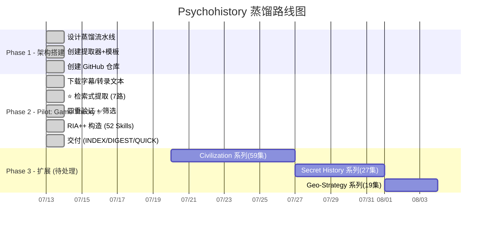

# 📊 Psychohistory - 项目进度追踪

> 最后更新: 2026-07-13
> Game Theory Pilot ✅ **全部完成**

---

## 🗺️ 路线图总览



---

## ✅ 已完成

### 📋 架构设计

- [x] `SPEC.md` — 检索式提取架构设计
- [x] `methodology/` — 8 篇详细流水线 SOP
- [x] `extractors/` — 7 个检索式提取器 + 信号表
- [x] `templates/` — 4 个输出模板

### 🎮 Game Theory Pilot — 29 集全流程

| 阶段 | 产出 | 状态 |
|---|---|---|
| Stage 0: 系列理解 | 29 集清单 + 主题弧划分 | ✅ |
| Stage 1: 检索式提取 | 7 路提取器 → 81+ 方法论候选 | ✅ |
| Stage 1.5: 四重验证 | 36 HIGH + 14 MEDIUM + 1 REJECT + 4 参考 | ✅ |
| Stage 2: RIA++ 构造 | **52 个 SKILL.md 文件**，含完整 R/I/A1/A2/E/B | ✅ |
| Stage 3-5: 交付 | ✅ INDEX.md + DIGEST.md + QUICK_START.md + 安装脚本 | ✅ |

### 📦 52 个 Skill 产出清单

| 分组 | 数量 | 核心技能 |
|---|---|---|
| 🎯 **博弈论框架** | 5 | 不对称法则、升级法则、邻近法则、移民陷阱、精英过剩 |
| 🌍 **地缘政治** | 3 | 咽喉要道、货币战争、地缘三定律 |
| 🏛️ **文明规律** | 8 | Asabiyyah、EOC 模型、三大超结构、精英过剩、制度硬化… |
| 📖 **宗教叙事** | 8 | 末世论编码、卡巴拉救赎、弥赛亚加速主义、AI 宗教化… |
| 🔮 **预测模型** ⭐ | 12 | **多重框架汇聚、末法汇聚、帝国衰退三指标、内战投射…** |
| ⚠️ **思维陷阱** | 7 | 伟人迷思、AI 意识幻觉、相关即因果、虚假二元对立… |
| 📖 **术语词典** | 9 | 博弈论定义、Elite Overproduction、Mosaic Defense… |

---

## 🟢 下一个系列待处理

| 系列 | 集数 | 预计 Skills | 优先级 |
|---|---|---|---|
| 📜 **Civilization** | **59** | 25-35 | ⭐⭐⭐ 最高 |
| 🔮 **Secret History** | **27** | 15-20 | ⭐⭐⭐ |
| 🗺️ **Geo-Strategy** | **19** | 12-18 | ⭐⭐ |
| 📚 **Great Books** | **13** | 8-12 | ⭐⭐ |
| 🔥 **Dante** | **12** | 8-10 | ⭐ |
| 🌐 Geo-Strategy Updates | 8 | 3-5 | ⭐ |

---

## 🚀 如何继续

### 开始一个新系列

```bash
# 以 Civilization 系列为例
1. 创建系列目录
   mkdir -p series/civilization/transcripts

2. 下载字幕
   python -m yt_dlp --write-auto-subs --sub-langs "en" --skip-download \
     -o "series/civilization/transcripts/%(title)s.%(ext)s" \
     "https://www.youtube.com/playlist?list=..."

3. 读取 methodology/ 确定流程
4. 以现有 7 个 extractors（可复用）+ 7 个新 series-specific 信号运行
5. 新 Skill 与已有 skills/ 做 Zettelkasten 链接
```

### 处理新视频（持续注入）

```
1. 确定视频属于哪个系列
2. 下载字幕 → transcripts/
3. 运行该系列对应提取器的检索信号
4. 新候选合并到 candidates/ → 跑四重验证
5. 更新 INDEX.md + DIGEST.md
6. 重新部署到 skills/
```

---

## 📌 方法论版本记录

| 版本 | 日期 | 变更 |
|------|------|------|
| **v4.0** | 2026-07-13 | Game Theory Pilot 完整验证。**跳过压力测试 + Zettelkasten 图**（性价比低），新增 QUICK_START.md（场景→技能速查） |
| v3.0 | 2026-07-13 | ⭐ 检索式提取替换两阶段摘要 |
| v2.0 | 2026-07-13 | 初始：两阶段摘要提取架构 |
