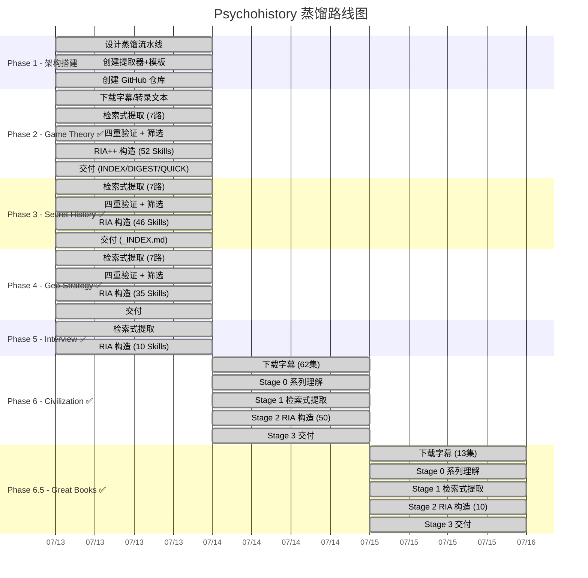

# 📊 Psychohistory - 项目进度追踪

> 最后更新: 2026-07-15 (v10.0 架构精简)
> ✅ 已完成 7 个系列 · 共 209 个技能文件

---

## 🗺️ 路线图总览

---

## ✅ 已完成

### 📋 架构设计

- [x] `SPEC.md` — 检索式提取架构设计
- [x] `methodology/` — 8 篇详细流水线 SOP
- [x] `extractors/` — 7 个检索式提取器 + 信号表
- [x] `templates/` — 4 个输出模板

### 🔰 Series 0: Psychohistory Origin — 元方法论 ✅

| 阶段 | 产出 | 状态 |
|---|---|---|
| RIA 构造 | **6 个 SKILL.md**，RIA 四段格式 | ✅ |
| 交付 | `series/psychohistory-origin/_INDEX.md` | ✅ |
| 技能位置 | `skills/ph-origin-*.md` + `series/psychohistory-origin/skills/` | ✅ 已同步 |

### 🎮 Series 1: Game Theory — 29 集 ✅

| 阶段 | 产出 | 状态 |
|---|---|---|
| Stage 0: 系列理解 | 29 集清单 + 主题弧划分 | ✅ |
| Stage 1: 检索式提取 | 7 路提取器 → 81+ 方法论候选 | ✅ |
| Stage 1.5: 四重验证 | 36 HIGH + 14 MEDIUM + 1 REJECT + 4 参考 | ✅ |
| Stage 2: RIA++ 构造 | **52 个 SKILL.md**，完整 R/I/A1/A2/E/B 六段格式 | ✅ |
| Stage 3-5: 交付 | INDEX.md + DIGEST.md + QUICK_START.md | ✅ |
| 技能位置 | `skills/gt-*.md`（已同步到根目录） | ✅ |

### 📜 Series 2: Secret History — 28 集 ✅

| 阶段 | 产出 | 状态 |
|---|---|---|
| 检索式提取 | 7 路提取器 → 92 候选 | ✅ |
| 查漏补缺 | 新增 5 个高价值模型 + 3 个 WW3 分析模型 | ✅ |
| 蒸馏 | **46 个 SKILL.md**，RIA 四段格式（R/I/A/B） | ✅ |
| 交付 | `series/secret-history/_INDEX.md` | ✅ |
| 技能位置 | `skills/sh-*.md`（已同步到根目录） | ✅ |

### 🗺️ Series 3: Geo-Strategy — 19 集 ✅

| 阶段 | 产出 | 状态 |
|---|---|---|
| 检索式提取 | 7 路提取器 → 77 候选 | ✅ |
| 蒸馏 | **35 个 SKILL.md**，RIA 四段格式（R/I/A/B） | ✅ |
| 技能位置 | `skills/gs-*.md`（已同步到根目录） | ✅ |

### 🎙️ Series 4: Interview (Jang Let's Talk) ✅

| 阶段 | 产出 | 状态 |
|---|---|---|
| 检索式提取 | 提取 | ✅ |
| 蒸馏 | **10 个 SKILL.md**，RIA 格式 | ✅ |
| 技能位置 | `skills/interview-*.md`（已同步到根目录） | ✅ |

### 📜 Series 5: Civilization — 62 集 ✅

| 阶段 | 产出 | 状态 |
|---|---|---|
| 下载字幕 | 62 个 VTT 文件（1 个私密视频跳过） | ✅ |
| Stage 0 系列理解 | SERIES_OVERVIEW.md（12 个主题弧） | ✅ |
| Stage 1 检索式提取 | 7 路提取器 → 26,057 匹配 → 50 候选 | ✅ |
| Stage 2 RIA 构造 | **50 个 SKILL.md**（civ-civ-*/civ-rel-*/civ-pred-*） | ✅ |
| Stage 3 交付 | _INDEX.md + 文档更新 | ✅ |
| 技能位置 | `skills/civ-*.md`（已同步到 series/civilization/skills/） | ✅ |

### 📚 Series 6: Great Books — 13 集 ✅

| 阶段 | 产出 | 状态 |
|---|---|---|
| 下载字幕 | 13 个 VTT 文件（GB#1–GB#13） | ✅ |
| Stage 0 系列理解 | SERIES_OVERVIEW.md | ✅ |
| Stage 1 检索式提取 | 7 路提取器 → 候选 → 10 最终 | ✅ |
| Stage 2 RIA 构造 | **10 个 SKILL.md**（gb-literature-*/gb-pred-*/gb-religion-*） | ✅ |
| Stage 3 交付 | _INDEX.md + 文档更新 | ✅ |
| 技能位置 | `skills/gb-*.md`（已同步到 series/great-books/skills/） | ✅ |

### 📦 技能汇总

| 系列 | 前缀 | 数量 | 位置 | 格式 |
|---|---|---|---|---|
| Psychohistory Origin | `ph-origin-` | 6 | `skills/` | RIA 四段 |
| Game Theory | `gt-` | 52 | `skills/` | RIA++ 六段 |
| Secret History | `sh-` | 46 | `skills/` | RIA 四段 |
| Geo-Strategy | `gs-` | 35 | `skills/` | RIA 四段 |
| Interview | `interview-` | 10 | `skills/` | RIA 四段 |
| Civilization | `civ-` | 50 | `skills/` | RIA 四段 |
| Great Books | `gb-` | 10 | `skills/` | RIA 四段 |
| **合计** | | **209** | | |

### 🧪 实战案例

| 编号 | 名称 | 模型数 |
|---|---|---|
| CASE-001 | 第三次世界大战催化阶段分析 | 12 |
| CASE-002 | 地缘经济展望 2026-2027 | 12 |

---

## 🟡 已知问题

| 问题 | 严重性 | 说明 | 状态 |
|---|---|---|---|
| RIA++ 格式不一致 | 🟡 中 | GT 用六段（R/I/A1/A2/E/B），其他用四段（R/I/A/B）。功能不受影响，统一为后续优化项 | ⏳ 待处理 |
| SH/GS/Interview 缺 verified.md | 🟡 低 | 部分系列未单独检出验证文件，已记录在案 | ⏳ 待处理 |
| INDEX.md 需持续维护 | 🟡 中 | 已完成全面重写覆盖全部 209 技能，后续新增需同步更新 | ✅ 已修复 |
| 文档统计数据滞后 | 🟢 已解决 | README/QUICK_START/CONTINUE_FOR_AI/MOC/INDEX 统计数字已同步至 209/7 系列 | ✅ v9.1 修复 |
| LICENSE 缺失 | 🟢 已解决 | 仓库无 LICENSE 文件 | ✅ v7.0 补充 |

---

---

## 📌 方法论版本记录

| 版本 | 日期 | 变更 |
|------|------|------|
| **v10.0** | 2026-07-15 | 文档单源化（统计数字仅留 PROGRESS.md）、删除 5 个 MOC、methodology 归档 3 个废弃 SOP、技能库存储单源化（series/*/skills/ 副本移除）、系统提示词新增分析立场声明、新增 PSYCHOHISTORY_LITE.md、安装脚本重写 |
| **v9.2** | 2026-07-15 | 移除 Dante 待处理系列 — 更新全部文档同步（CLAUDE.md/INDEX.md/README/MOC/CONTINUE_FOR_AI/PROGRESS/SPEC/DIGEST），所有系列已完工，无待处理项 |
| **v9.1** | 2026-07-15 | Great Books 系列完成 — 13 集字幕下载、Stage 0-3 全流程、10 个 SKILL.md（gb-literature-*/gb-pred-*/gb-religion-*），总技能数 199→209，系列数 6→7 |
| **v9.0** | 2026-07-14 | 新增七层汇聚验证框架（Stage 6）：methodology/08-stage6-convergence-verify.md。升级PSYCHOHISTORY_SYSTEM_PROMPT.md核心方法，更新QUICK_START.md工作流，同步所有MOC文档。方法论版本：检索式提取 v9.0 |
| **v8.0** | 2026-07-14 | Civilization 系列完成 — 62 集字幕下载、Stage 0-3 全流程、50 个 SKILL.md（civ-civ-*/civ-rel-*/civ-pred-*），总技能数 149→199 |
| **v7.0** | 2026-07-14 | 文档全面修复：README 重写为 Wikipedia 风格、统计数据同步至 149/5 系列、补充 LICENSE、修复 CONTINUE_FOR_AI/MOC 所有滞后内容 |
| **v6.0** | 2026-07-13 | 全面修复：同步全部技能到根目录（149个）、重写INDEX.md覆盖全系列、修复PROGRESS.md数字、新增Origin系列记录和实战案例模块 |
| **v5.0** | 2026-07-13 | 全面审计：更新项目状态反映 4 个系列 142 个技能已完成 |
| v4.0 | 2026-07-13 | Game Theory Pilot 完整验证。新增 QUICK_START.md |
| v3.0 | 2026-07-13 | 检索式提取替换两阶段摘要 |
| v2.0 | 2026-07-13 | 初始：两阶段摘要提取架构 |
