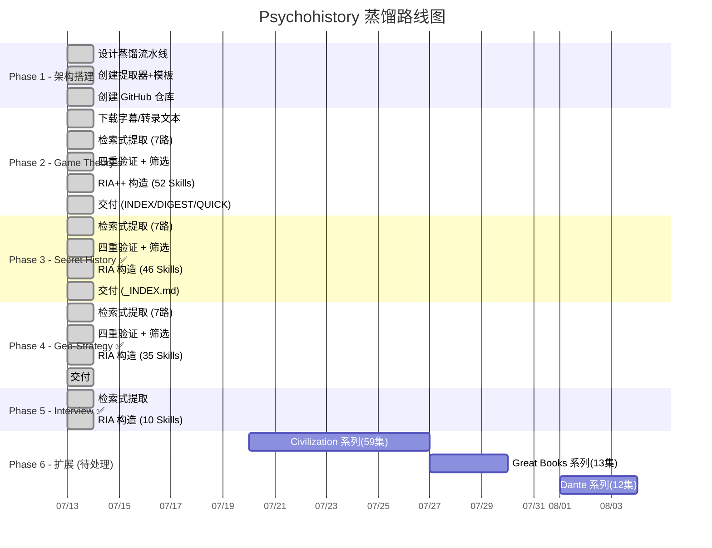

# 📊 Psychohistory - 项目进度追踪

> 最后更新: 2026-07-14 (v7.0 文档修复)
> ✅ 已完成 5 个系列 · 共 149 个技能文件

---

## 🗺️ 路线图总览

---

## ✅ 已完成

### 📋 架构设计

- [x] `SPEC.md` — 检索式提取架构设计
- [x] `methodology/` — 8 篇详细流水线 SOP
- [x] `extractors/` — 7 个检索式提取器 + 信号表
- [x] `templates/` — 4 个输出模板

### 🔰 Series 0: Psychohistory Origin — 元方法论 ✅

| 阶段 | 产出 | 状态 |
|---|---|---|
| RIA 构造 | **6 个 SKILL.md**，RIA 四段格式 | ✅ |
| 交付 | `series/psychohistory-origin/_INDEX.md` | ✅ |
| 技能位置 | `skills/ph-origin-*.md` + `series/psychohistory-origin/skills/` | ✅ 已同步 |

### 🎮 Series 1: Game Theory — 29 集 ✅

| 阶段 | 产出 | 状态 |
|---|---|---|
| Stage 0: 系列理解 | 29 集清单 + 主题弧划分 | ✅ |
| Stage 1: 检索式提取 | 7 路提取器 → 81+ 方法论候选 | ✅ |
| Stage 1.5: 四重验证 | 36 HIGH + 14 MEDIUM + 1 REJECT + 4 参考 | ✅ |
| Stage 2: RIA++ 构造 | **52 个 SKILL.md**，完整 R/I/A1/A2/E/B 六段格式 | ✅ |
| Stage 3-5: 交付 | INDEX.md + DIGEST.md + QUICK_START.md | ✅ |
| 技能位置 | `skills/gt-*.md`（已同步到根目录） | ✅ |

### 📜 Series 2: Secret History — 28 集 ✅

| 阶段 | 产出 | 状态 |
|---|---|---|
| 检索式提取 | 7 路提取器 → 92 候选 | ✅ |
| 查漏补缺 | 新增 5 个高价值模型 + 3 个 WW3 分析模型 | ✅ |
| 蒸馏 | **46 个 SKILL.md**，RIA 四段格式（R/I/A/B） | ✅ |
| 交付 | `series/secret-history/_INDEX.md` | ✅ |
| 技能位置 | `skills/sh-*.md`（已同步到根目录） | ✅ |

### 🗺️ Series 3: Geo-Strategy — 19 集 ✅

| 阶段 | 产出 | 状态 |
|---|---|---|
| 检索式提取 | 7 路提取器 → 77 候选 | ✅ |
| 蒸馏 | **35 个 SKILL.md**，RIA 四段格式（R/I/A/B） | ✅ |
| 技能位置 | `skills/gs-*.md`（已同步到根目录） | ✅ |

### 🎙️ Series 4: Interview (Jang Let's Talk) ✅

| 阶段 | 产出 | 状态 |
|---|---|---|
| 检索式提取 | 提取 | ✅ |
| 蒸馏 | **10 个 SKILL.md**，RIA 格式 | ✅ |
| 技能位置 | `skills/interview-*.md`（已同步到根目录） | ✅ |

### 📦 技能汇总

| 系列 | 前缀 | 数量 | 位置 | 格式 |
|---|---|---|---|---|
| Psychohistory Origin | `ph-origin-` | 6 | `skills/` | RIA 四段 |
| Game Theory | `gt-` | 52 | `skills/` | RIA++ 六段 |
| Secret History | `sh-` | 46 | `skills/` | RIA 四段 |
| Geo-Strategy | `gs-` | 35 | `skills/` | RIA 四段 |
| Interview | `interview-` | 10 | `skills/` | RIA 四段 |
| **合计** | | **149** | | |

### 🧪 实战案例

| 编号 | 名称 | 模型数 |
|---|---|---|
| CASE-001 | 第三次世界大战催化阶段分析 | 12 |
| CASE-002 | 地缘经济展望 2026-2027 | 12 |

---

## 🟡 已知问题

| 问题 | 严重性 | 说明 | 状态 |
|---|---|---|---|
| RIA++ 格式不一致 | 🟡 中 | GT 用六段（R/I/A1/A2/E/B），其他用四段（R/I/A/B）。功能不受影响，统一为后续优化项 | ⏳ 待处理 |
| SH/GS/Interview 缺 verified.md | 🟡 低 | 部分系列未单独检出验证文件，已记录在案 | ⏳ 待处理 |
| INDEX.md 需持续维护 | 🟡 中 | 已完成全面重写覆盖全部 149 技能，后续新增需同步更新 | ✅ 已修复 |
| 文档统计数据滞后 | 🟢 已解决 | README/QUICK_START/CONTINUE_FOR_AI/MOC 统计数字已同步至 149/5 系列 | ✅ v7.0 修复 |
| LICENSE 缺失 | 🟢 已解决 | 仓库无 LICENSE 文件 | ✅ v7.0 补充 |

---

## 🟢 下一个系列待处理

| 系列 | 集数 | 预计 Skills | 优先级 |
|---|---|---|---|
| 📜 **Civilization** | **59** | 25-35 | ⭐⭐⭐ 最高 |
| 📚 **Great Books** | **13** | 8-12 | ⭐⭐ |
| 🔥 **Dante** | **12** | 8-10 | ⭐ |

---

## 📌 方法论版本记录

| 版本 | 日期 | 变更 |
|------|------|------|
| **v7.0** | 2026-07-14 | 文档全面修复：README 重写为 Wikipedia 风格、统计数据同步至 149/5 系列、补充 LICENSE、修复 CONTINUE_FOR_AI/MOC 所有滞后内容 |
| **v6.0** | 2026-07-13 | 全面修复：同步全部技能到根目录（149个）、重写INDEX.md覆盖全系列、修复PROGRESS.md数字、新增Origin系列记录和实战案例模块 |
| **v5.0** | 2026-07-13 | 全面审计：更新项目状态反映 4 个系列 142 个技能已完成 |
| v4.0 | 2026-07-13 | Game Theory Pilot 完整验证。新增 QUICK_START.md |
| v3.0 | 2026-07-13 | 检索式提取替换两阶段摘要 |
| v2.0 | 2026-07-13 | 初始：两阶段摘要提取架构 |
