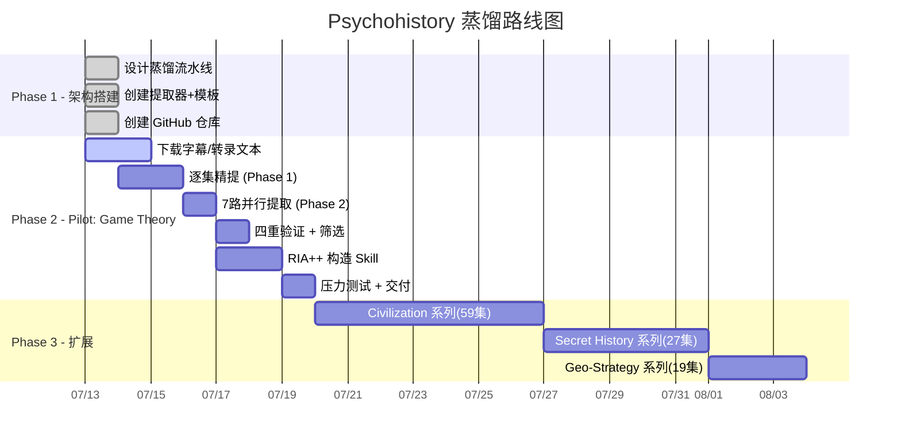

# 📊 Psychohistory - 项目进度追踪

> 最后更新: 2026-07-13

---

## 🗺️ 路线图总览




---

## ✅ 已完成

### 📋 架构设计 (`SPEC.md`)

- [x] 7 阶段蒸馏流水线定义
- [x] 7 路自定义提取器设计（含 ★预测模型提取器）
- [x] 四重验证机制（V1-V4）
- [x] 两阶段精炼流程
- [x] 跨系列 Zettelkasten 链接方案

### 📝 方法论文档 (8篇)

- [x] `00-overview.md` — 全景概览
- [x] `01-stage0-series-understand.md` — 系列理解
- [x] `02-stage1-parallel-extract.md` — 并行提取
- [x] `03-stage1.5-quadruple-verify.md` — 四重验证
- [x] `04-stage2-ria-plus.md` — RIA++ 构造
- [x] `05-stage3-cross-series-link.md` — 跨系列链接
- [x] `06-stage4-pressure-test.md` — 压力测试
- [x] `07-stage5-deliver.md` — 交付

### 🎯 提取器 Prompt (7个)

- [x] `01-game-theory-extractor.md` — 博弈模型
- [x] `02-geopolitics-extractor.md` — 地缘法则
- [x] `03-civilization-extractor.md` — 文明规律
- [x] `04-religion-extractor.md` — 宗教叙事
- [x] `05-predictive-extractor.md` — ⭐ 预测模型
- [x] `06-failure-extractor.md` — 反例陷阱
- [x] `07-glossary-extractor.md` — 术语词典

### 📄 输出模板 (4个)

- [x] `SERIES_OVERVIEW.md.template`
- [x] `SKILL.md.template`
- [x] `PSYCHOHISTORY_INDEX.md.template`
- [x] `test-prompts.json.template`

### 🌐 GitHub 仓库

- [x] 仓库创建完成
- [x] 初始代码推送

---

## 🔵 进行中

### Game Theory 系列 (Pilot)

```
系列: Game Theory
集数: 29 (GT#1 - GT#29 + Final Examination)
总时长: ~15 小时
YouTube: https://www.youtube.com/@PredictiveHistory
```

#### 剧集清单

| # | 标题 | 时长 | 转录 | 精提 |
|---|---|---|---|---|
| 1 | The Dating Game | 50min | ⏳ | ⏳ |
| 2 | Why Schools Suck | 49min | ⏳ | ⏳ |
| 3 | Rich Dad, Poor Dad | 54min | ⏳ | ⏳ |
| 4 | The Immigration Trap | 46min | ⏳ | ⏳ |
| 5 | The World Game | 57min | ⏳ | ⏳ |
| 6 | The World's Bank | 45min | ⏳ | ⏳ |
| 7 | America's Game | 49min | ⏳ | ⏳ |
| 8 | Communist Specter | 55min | ⏳ | ⏳ |
| 9 | The US-Iran War | 45min | ⏳ | ⏳ |
| 10 | The Law of Asymmetry | 54min | ⏳ | ⏳ |
| 11 | The Law of Escalation | 61min | ⏳ | ⏳ |
| 12 | The Law of Eschatological Convergence | 66min | ⏳ | ⏳ |
| 13 | Epstein's World | 50min | ⏳ | ⏳ |
| 14 | The Law of Proximity | 50min | ⏳ | ⏳ |
| 15 | The Return of History | 50min | ⏳ | ⏳ |
| 16 | Pax Judaica Rising | 67min | ⏳ | ⏳ |
| 17 | The Great Reset | 58min | ⏳ | ⏳ |
| 18 | Trump World Order | 49min | ⏳ | ⏳ |
| 19 | The Hollywood-Pentagon Complex | 54min | ⏳ | ⏳ |
| 20 | Mid-Term Examination | 83min | ⏳ | ⏳ |
| 21 | World War Trump | 59min | ⏳ | ⏳ |
| 22 | Twilight of the Nation-State | 56min | ⏳ | ⏳ |
| 23 | The WWIII Chessboard | 60min | ⏳ | ⏳ |
| 24 | The AI Apocalypse | 64min | ⏳ | ⏳ |
| 25 | Trump Visits China | 73min | ⏳ | ⏳ |
| 26 | The Holy Empire of AI | 67min | ⏳ | ⏳ |
| 27 | Putin Enters the Chat | 73min | ⏳ | ⏳ |
| 28 | Predictive History | 76min | ⏳ | ⏳ |
| 29 | Final Examination | 120min | ⏳ | ⏳ |

---

## ⏳ 待处理

| 系列 | 集数 | 预计 Skills | 优先级 |
|---|---|---|---|
| 📜 Civilization | 59 | 25-35 | ⭐⭐⭐ |
| 🔮 Secret History | 27 | 15-20 | ⭐⭐⭐ |
| 🗺️ Geo-Strategy | 19 | 12-18 | ⭐⭐ |
| 📚 Great Books | 13 | 8-12 | ⭐⭐ |
| 🔥 Dante | 12 | 8-10 | ⭐ |
| 🌍 Geo-Strategy Updates | 8 | 3-5 | ⭐ |

---

## 📌 持续注入流程

当新视频发布时：

1. 确定视频属于哪个系列（Game Theory / Civilization 等）
2. 下载字幕 → ASR 转录
3. 运行 Phase 1 逐集精提 → 提取该集方法论
4. 与现有候选池合并 → 跑 Phase 2 全流程
5. 更新 INDEX.md + 重新建立 Zettelkasten 链接
6. 重新部署到 skills 目录
