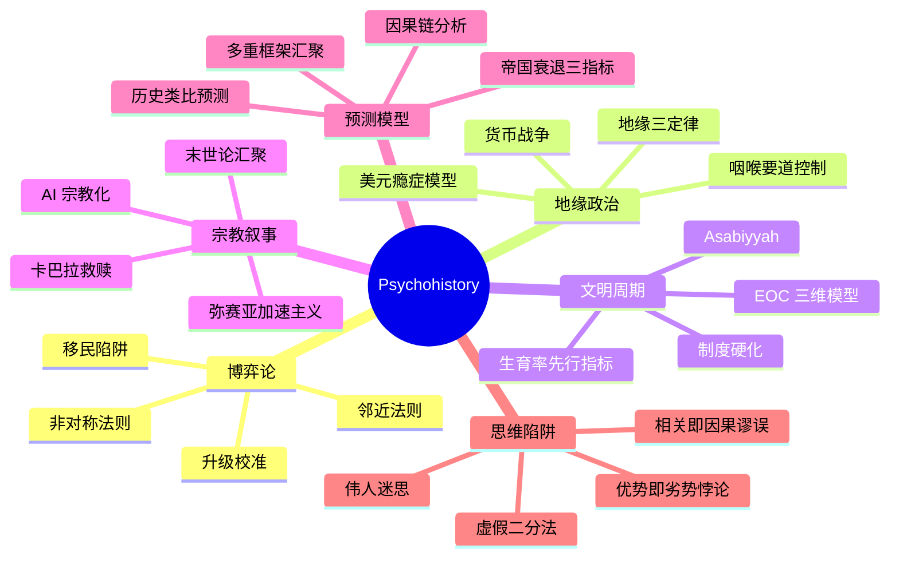

<p align="center">
  <pre>
    ┌─────────────────────────────────────────────────────┐
    │                                                     │
    │   ██████╗ ███████╗██╗   ██╗ ██████╗██╗  ██╗        │
    │   ██╔══██╗██╔════╝╚██╗ ██╔╝██╔════╝██║  ██║        │
    │   ██████╔╝███████╗ ╚████╔╝ ██║     ███████║        │
    │   ██╔═══╝ ╚════██║  ╚██╔╝  ██║     ██╔══██║        │
    │   ██║     ███████║   ██║   ╚██████╗██║  ██║        │
    │   ╚═╝     ╚══════╝   ╚═╝    ╚═════╝╚═╝  ╚═╝        │
    │                                                     │
    │   ██╗  ██╗██╗███████╗████████╗ ██████╗ ██████╗     │
    │   ██║  ██║██║██╔════╝╚══██╔══╝██╔═══██╗██╔══██╗    │
    │   ███████║██║███████╗   ██║   ██║   ██║██████╔╝    │
    │   ██╔══██║██║╚════██║   ██║   ██║   ██║██╔══██╗    │
    │   ██║  ██║██║███████║   ██║   ╚██████╔╝██║  ██║    │
    │   ╚═╝  ╚═╝╚═╝╚══════╝   ╚═╝    ╚═════╝ ╚═╝  ╚═╝    │
    │                                                     │
    └─────────────────────────────────────────────────────┘
  </pre>
</p>

<p align="center">
  <em>「心理史学不是占卜。它是基于可识别结构模式、明确边界条件<br>和可证伪逻辑链条的多框架交叉验证方法。」</em>
</p>

<br>

<p align="center">
  <a href="LICENSE"></a>
  <a href="skills/"></a>
  <a href="series/"></a>
  <a href="PROGRESS.md"></a>
  <a href="https://github.com/chundada/psychohistory"></a>
</p>

---

<br>

## 概述

**心理史学（Psychohistory）** 是 Isaac Asimov 在《基地》系列中提出的虚构科学——揉合历史学、数学、社会心理学、社会学与统计学，用于预测巨大人口的未来活动。Asimov 借鉴热力学原理：单个粒子的运动不可描述，但大量粒子的运动可以精确描述。

本项目将这一理念工程化：不建模数学公式，而是将涵盖 **博弈论、地缘政治、文明规律、宗教叙事** 四大领域的知识体系蒸馏为 **209 个结构化、可复用的 AI Skill 文件**，供 AI 直接调用。

> **方法论版本 v9.1** · 核心分析方法：**七层汇聚验证**（Seven-Layer Convergence Verification）——将 7+1 个独立分析框架汇聚对比，通过汇聚度评分提升预测置信度。详见 `methodology/08-stage6-convergence-verify.md`。

<br>



<br>

---

## 方法论

### 检索式蒸馏

传统知识蒸馏遵循"压缩→摘要"路线，存在不可逆的信息损失。本项目采用**检索式提取（Retrieval-based Extraction）**方案：

```
┌─────────────────────────────────────────────────────────────────┐
│                                                                 │
│  原始字幕 (完整保留，零压缩)                                      │
│        │                                                         │
│        ▼                                                         │
│  7 路并行提取器 ──── 检索信号定位 → 上下文剪裁 → 时间戳锚定     │
│        │                                                         │
│        ▼                                                         │
│  四重验证 ──── V1跨域 │ V2预测力 │ V3独特性 │ V4体系兼容        │
│        │                                                         │
│        ▼                                                         │
│  RIA/RIA++ 构造 ──── R(原文)→I(方法论)→A(案例)→E(步骤)→B(边界) │
│        │                                                         │
│        ▼                                                         │
│  skills/ 目录 ──── 209 个可调用 Skill 文件                        │
│                                                                 │
└─────────────────────────────────────────────────────────────────┘
```

### 7 路提取器

| 提取器 | 检索信号 | 产出类型 |
|:-------|:---------|:---------|
| **博弈模型** | 囚徒困境、非对称、升级、MAD、承诺、均衡 | 博弈论框架 |
| **地缘法则** | 心脏地带、修昔底德陷阱、咽喉要道、缓冲区、帝国 | 地缘规律 |
| **文明规律** | 精英过剩、Asabiyyah、制度硬化、崩溃、兴衰 | 文明周期模型 |
| **宗教叙事** | 弥赛亚、末世论、一神教、神圣文本、预言 | 叙事解码 |
| **预测模型** | 如果…那么、预测、场景推演、临界点、拐点 | 预测推理链 |
| **经济金融** | 债务、泡沫、通胀、美元霸权、信贷危机、货币政策 | 经济框架 |
| **术语词典** | 作者自创术语、反复出现的核心概念、关键定义 | 核心概念 |

> 每个提取器独立扫描全文，检索信号命中时读取前后至少 5 行上下文，提取结果包含 `[source] = 文件名 + 时间戳范围` 作为引文锚点。

<br>

---

## 系列分布

<p align="center">
  <strong>已完成 7 个系列 · 209 个 Skill · 持续扩张中</strong>
</p>

| 系列 | 来源 | 技能数 | 格式 | 路径 |
|:-----|:-----|:-------|:-----|:-----|
| 🔰 Psychohistory Origin | 元方法论 | 6 | RIA 四段 | `skills/ph-origin-*.md` |
| 🎮 Game Theory | 29 集 | 52 | RIA++ 六段 | `skills/gt-*.md` |
| 📜 Secret History | 28 集 | 46 | RIA 四段 | `skills/sh-*.md` |
| 🗺️ Geo-Strategy | 19 集 | 35 | RIA 四段 | `skills/gs-*.md` |
| 🎙️ Interview | — | 10 | RIA 四段 | `skills/interview-*.md` |
| 🌍 Civilization | 62 集 | 50 | RIA 四段 | `skills/civ-*.md` |
| 📚 Great Books | 13 集 | 10 | RIA 四段 | `skills/gb-*.md` |
| **合计** | **~151 集** | **209** | | |

### 待处理

| 系列 | 集数 | 预计技能数 | 优先级 |
|:-----|:-----|:-----------|:-------|
| 🔥 Dante | 12 | 8-10 | ⭐ |

<br>

---

## 核心交付物

| 交付物 | 说明 |
|:-------|:-----|
| **209 个 Skill 文件** | 结构化分析框架，RIA/RIA++ 格式，原文引用+方法论+边界条件 |
| **PSYCHOHISTORY_SYSTEM_PROMPT.md** | 完整角色激活提示——粘贴到任意 AI 中即刻激活心理史学家身份 |
| **QUICK_START.md** | 场景→技能速查表（22 个场景映射到推荐技能组合） |
| **INDEX.md** | Zettelkasten 风格全局索引，含触发场景关键词和术语表 |
| **DIGEST.md** | Game Theory 系列精华长文阅读（10,000 字） |
| **PROGRESS.md** | 项目进度追踪与路线图 |
| **实战案例** | CASE-001 第三次世界大战催化阶段分析、CASE-002 地缘经济展望 2026-2027 |

<br>

---

## 快速开始

### 方式 A：克隆并安装

```powershell
git clone https://github.com/chundada/psychohistory.git
cd psychohistory
PowerShell -ExecutionPolicy Bypass .\_install_skills.ps1
```

### 方式 B：配合任意 AI 使用

将 `PSYCHOHISTORY_SYSTEM_PROMPT.md` 粘贴为系统提示，AI 将自动：

1. 激活心理史学家身份
2. 从技能库中选取 2-4 个相关技能
3. 执行 **多重框架汇聚验证**
4. 使用思维陷阱清单进行自我校准
5. 输出 **条件式预测**，附带明确的边界条件

### 核心工作流

```
Step 1: 定位博弈       → 地缘政治三定律 + 邻近法则
Step 2: 评估力量       → 非对称法则 + EOC 三维模型
Step 3: 检查信号       → 帝国衰退三指标 + 精英过剩
Step 4: 解码叙事       → 末法汇聚 + 末世论编码
Step 5: 多重验证       → 多重框架汇聚验证法
Step 6: 校准偏见       → 7 个 Failure Mode Skills
```

<br>

---

## 仓库结构

```
Psychohistory/
├── PSYCHOHISTORY_SYSTEM_PROMPT.md   角色激活提示
├── skills/                           209 个结构化 Skill 文件
│   ├── ph-origin-*.md                Psychohistory Origin（6）
│   ├── gt-*.md                       Game Theory（52）
│   ├── sh-*.md                       Secret History（46）
│   ├── gs-*.md                       Geo-Strategy（35）
│   ├── interview-*.md                Interview（10）
│   ├── civ-*.md                      Civilization（50）
│   └── gb-*.md                       Great Books（10）
├── cases/                            实战分析案例
├── QUICK_START.md                    场景→技能速查表
├── DIGEST.md                         精华阅读
├── INDEX.md                          Zettelkasten 索引
├── PROGRESS.md                       项目进度追踪
├── CLAUDE.md                         AI 工作区配置
├── extractors/                       7 路检索式提取器 Prompt
├── methodology/                      蒸馏流水线 SOP（8 篇）
├── templates/                        输出模板
├── series/                           各系列源数据
│   ├── psychohistory-origin/
│   ├── game-theory/
│   ├── geo-strategy/
│   ├── secret-history/
│   ├── interview-jang-letstalk/
│   ├── civilization/
│   └── great-books/
├── SPEC.md                           设计规范
├── MOC-心理史学总览.md               Obsidian 图谱入口
├── MOC-系列目录.md                   系列索引
├── MOC-核心方法论.md                  方法论索引
└── MOC-Game-Theory.md                Game Theory 入口
```

<br>

---

## 学术脉络

心理史学作为分析框架，其思想渊源可追溯至：

| 思想来源 | 贡献 | 在项目中的体现 |
|:---------|:-----|:--------------|
| **Isaac Asimov《基地》系列** | 心理史学概念：以统计数学预测人类社会未来 | 项目命名与根本理念 |
| **Peter Turchin 历史动力学** | 精英过剩崩溃模型、Asabiyyah 凝聚力理论 | 文明周期分析核心框架 |
| **Karl Marx 历史唯物主义** | 历史发展有其客观规律 | 社会结构分析方法论 |
| **Halford Mackinder 心脏地带** | 地缘政治三定律 | 地缘分析框架基础 |
| **Thomas Kuhn 范式转换** | 科学革命的结构 | 制度硬化与文明衰落对应 |

<br>

---

<p align="center">
  <strong>209 个心理史学模型 · 7 个系列 · 持续扩张中</strong><br><br>
  <em>「预测的目的不是为了预见未来——而是让未来变得更好。」</em><br><br>
  <sub>— Isaac Asimov, Foundation</sub>
</p>

<p align="center">
  <a href="LICENSE"></a>
  <a href="https://github.com/chundada/psychohistory"></a>
  <a href="https://github.com/chundada/psychohistory"></a>
</p>